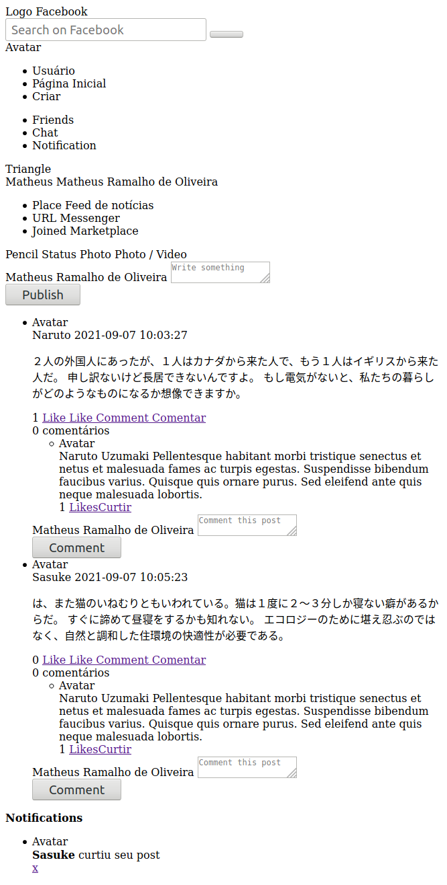

## GoStack Bootcamp Bonus 4

> 🚀 Practical project of the [Rocketseat](https://rocketseat.com.br) GoStack Bootcamp.  
👷 Developed by Matheus Ramalho de Oliveira.  
🔨 Systems Analyst, Full-Stack Developer.  
🏡 Goiânia, Goiás, Brasil.  
✉️ kastorcode@gmail.com  
👍 [instagram.com/kastorcode](https://www.instagram.com/kastorcode)

---

  

    Bonus 4, AdonisJS WebSocket: Facebook Posts and Notifications

---

### Screenshot

  

---

### 🚀 Installation and execution

1. Make a clone of this repository;
2. Enter the folder running `cd gostack-bonus-04-adonisjs-websocket-facebook`;
3. Run `yarn` to install dependencies;
4. Create a database in `postgres` with the name of `adonis-ws-fb`;
5. Rename the `.env.example` file to `.env`;
6. Put your credentials within `.env`;
7. Run `adonis migration:run` to execute the migrations;
8. Run `yarn start` to start the development server;
9. Import the `insomnia/index.json` file in Insomnia to make calls to api;
10. Open the file `resources/views/index.html` on two browser tabs;
11. Add the `id` and `token` parameters in both URLs, for example: `index.html?id=0&token=ABCDE`.

---

### 🗓 ️Roadmap

- Introduction to Node.js
- Creating Node.js project
- Continuing Node.js project
- CSS Flexbox
- UI Design
- Introduction to React
- First project with ReactJS
- First project with React Native
- Front-end documentation
- Flux architecture
- Using React Hooks
- Server-side rendering(SSR) with ReactJS
- GraphQL
- Expo
- Creating ReactJS project
- Creating React Native project
- Animations with React Native
- Full-stack app development
- Node.js tests
- Node.js deploy
- ReactJS tests
- React Native tests
- ReactJS deploy
- React Native publication
- WebSocket with Express
- Advanced patterns at Node.js
- OmniStack SaaS(software as a service) and AdonisJS
- Final challenge
- Monorepo
